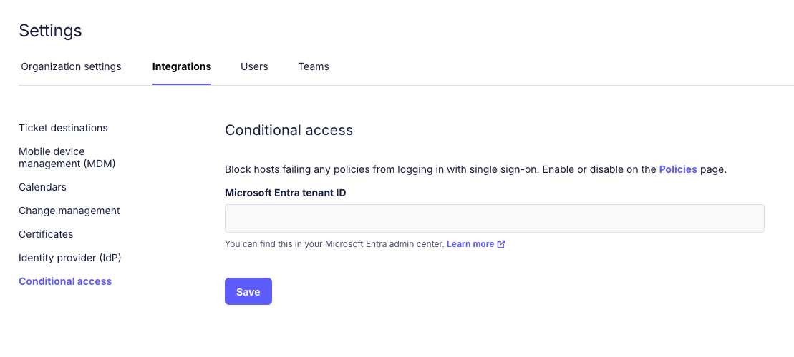
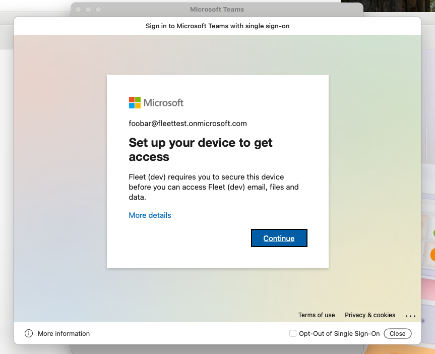

# Conditional access: Entra

With Fleet, you can integrate with Microsoft Entra to enforce conditional access on macOS hosts.

When a host fails a policy in Fleet, Fleet can mark it as non-compliant in Entra. This allows IT and Security teams to block access to third-party apps until the issue is resolved.

Migrating from your current MDM solution to Fleet? Head to the [migration instructions](#migration).

Entra conditional access is supported even if you're not using MDM features in Fleet.

[Microsoft](https://learn.microsoft.com/en-us/intune/intune-service/protect/device-compliance-partners) requires that this feature is only supported if you're a Fleet Premium customer using managed cloud. To learn more, [get in touch with sales](https://fleetdm.com/contact). We'd love to chat.

## 1: Create a "Fleet conditional access" group in Entra

To enforce conditional access, end users must be members of a group called **Fleet conditional access** in Entra.

1. In Entra, create a new group named **Fleet conditional access**.

2. Assign the users you want to include.

## 2: Configure Fleet in Intune

1. Log in to [Intune](https://intune.microsoft.com), and follow [this Microsoft guide](https://learn.microsoft.com/en-us/intune/intune-service/protect/device-compliance-partners#add-a-compliance-partner-to-intune) to add Fleet as a compliance partner in Intune.

2. For **Platform**, select **macOS**. If you're migrating from your old MDM solution to Fleet, follow [these steps](#migration). **macOS** won't appear until you delete your old MDM solution in Intune.

3. For **Assignments** add the "Fleet conditional access" group you created to **Included groups**. 
>**Important:** Do not select **Add all users** or pick a different group. Fleet requires the "Fleet conditional access" group.

4. Save your changes. The newly created Fleet partner will show a "Pending activation" status.


## 3: Connect Fleet to Entra

Connect and provision Fleet to operate on your Entra ID tenant (activate partner).

1. Find your Microsoft Entra tenant ID at https://entra.microsoft.com. See [Microsoft's guide](https://learn.microsoft.com/en-us/entra/fundamentals/how-to-find-tenant) for instructions.

2. In Fleet, go to **Settings > Integrations > Conditional access** and enter the tenant ID.



3. Click **Save**. You will be redirected to https://login.microsoftonline.com to consent to Fleet's multi-tenant app permissions.

4. After consenting, you will be redirected back to Fleet (**Settings > Integrations > Conditional access**). A green checkmark confirms the connection.

>**Note:** If you don't see the checkmark in Fleet, confirm that a "Fleet conditional access" group exists in Entra. If it doesn and the checkmark still doesn't appear, [contact support](https://fleetdm.com/support)


## 4: Deploy Company Portal and the Platform SSO configuration profile 

The following steps apply to the Fleet teams where you want to enable Microsoft conditional access.

>**Note:** Microsoft’s Company Portal app is required to enroll macOS devices into Intune for conditional access. Fleet must deploy this app automatically before users can register with Entra ID.

### Automatically install Company Portal

1. Download the [Company Portal macOS app](https://go.microsoft.com/fwlink/?linkid=853070) from Microsoft.

2. In Fleet, go to **Software > Add software > Custom package**.

3. Upload `CompanyPortal-Installer.pkg` and check **Automatic install**.


4. To deploy Company Portal during automatic enrollment (ADE), go to **Controls > Setup experience > Install software > Add software**, select **Company portal**, and click **Save**. 


### Add "Company Portal installed" label

Create a dynamic label to identify devices where Company Portal is installed. 

>**Note:** Fleet uses this label to ensure the required Platform SSO configuration profile (see next step) is only deployed to hosts that already have Company Portal.

1. Go to **Hosts > Filter by platform or label > Add label > Dynamic**.

2. Configure the label:

 - Name: `Company Portal installed`
 - Description: `Company Portal is installed on the host.`
 - Query:
   ```sql
   SELECT 1 FROM apps WHERE bundle_identifier = 'com.microsoft.CompanyPortalMac';
   ```
 - Platform: `macOS`

### Deploy Platform SSO configuration profile

Entra conditional access requires a Platform SSO extension for Company Portal. The extension must be deployed via configuration profiles. See [Microsoft's documentation](https://learn.microsoft.com/en-us/intune/intune-service/configuration/platform-sso-macos#step-3---deploy-the-company-portal-app-for-macos) for details. 

1. In Fleet, go to **Controls > OS settings > Custom settings > Add profile**.

2. Set **Target > Custom > Include all** and select **Company Portal installed**.

3. Upload `company-portal-single-signon-extension.mobileconfig`.

```xml
<?xml version="1.0" encoding="UTF-8"?>
<!DOCTYPE plist PUBLIC "-//Apple//DTD PLIST 1.0//EN" "http://www.apple.com/DTDs/PropertyList-1.0.dtd">
<plist version="1.0">
<dict>
    <key>PayloadContent</key>
    <array>
        <dict>
            <key>AuthenticationMethod</key>
            <string>UserSecureEnclaveKey</string>
            <key>ExtensionIdentifier</key>
            <string>com.microsoft.CompanyPortalMac.ssoextension</string>
            <key>PayloadDisplayName</key>
            <string>Company Portal single sign-On extension</string>
            <key>PayloadIdentifier</key>
            <string>com.apple.extensiblesso.DC6F30E3-2FF3-4AEA-BD5C-9ED17A3ABDD9</string>
            <key>PayloadType</key>
            <string>com.apple.extensiblesso</string>
            <key>PayloadUUID</key>
            <string>DC6F30E3-2FF3-4AEA-BD5C-9ED17A3ABDD9</string>
            <key>PayloadVersion</key>
            <integer>1</integer>
            <key>PlatformSSO</key>
            <dict>
                <key>AuthenticationMethod</key>
                <string>UserSecureEnclaveKey</string>
                <key>TokenToUserMapping</key>
                <dict>
                    <key>AccountName</key>
                    <string>preferred_username</string>
                    <key>FullName</key>
                    <string>name</string>
                </dict>
                <key>UseSharedDeviceKeys</key>
                <true/>
            </dict>
            <key>ScreenLockedBehavior</key>
            <string>DoNotHandle</string>
            <key>TeamIdentifier</key>
            <string>UBF8T346G9</string>
            <key>Type</key>
            <string>Redirect</string>
            <key>URLs</key>
            <array>
                <string>https://login.microsoftonline.com</string>
                <string>https://login.microsoft.com</string>
                <string>https://sts.windows.net</string>
                <string>https://login.partner.microsoftonline.cn</string>
                <string>https://login.chinacloudapi.cn</string>
                <string>https://login.microsoftonline.us</string>
                <string>https://login-us.microsoftonline.com</string>
            </array>
        </dict>
    </array>
    <key>PayloadDisplayName</key>
    <string>Company Portal single sign-on extension</string>
    <key>PayloadIdentifier</key>
    <string>com.fleetdm.platformsso.26CB08D2-8229-4CC2-86B6-1880A165CB4A</string>
    <key>PayloadType</key>
    <string>Configuration</string>
    <key>PayloadUUID</key>
    <string>26CB08D2-8229-4CC2-86B6-1880A165CB4A</string>
    <key>PayloadVersion</key>
    <integer>1</integer>
</dict>
</plist>
```

If you're using another MDM solution, add the same configuration profile and target only macOS hosts with Company Portal installed.

> `UserSecureEnclaveKey` will be mandatory starting in Q3 2025. See [Microsoft's documentation](https://learn.microsoft.com/en-us/entra/identity-platform/apple-sso-plugin#upcoming-changes-to-device-identity-key-storage)


## 5: Add Fleet policies

Fleet uses policies to mark devices as compliant or non-compliant in Entra.

1. In Fleet, go to **Policies > Select team > Automations > Conditional access**.

2. Enable **Conditional access** for the team.

3. Select the policies you want to enforce.

## 6: Add Entra policies

1. In Entra, create a conditional access policy to block access to specific resources (e.g., Office 365 or other apps connected to Entra ID) when Fleet reports a device as non-compliant. See [Microsoft's guide](https://learn.microsoft.com/en-us/entra/identity/conditional-access/concept-conditional-access-policies) for details.


2. Assign the policy to the **Fleet conditional access** group.

3. Start by adding a small set of users (e.g., IT or a single department) to the group and confirm the setup.

4. Expand the group gradually until all users are included.

>**Note:** Rolling out gradually helps avoid widespread lockouts if a policy is misconfigured.

>**Note:** Users outside the group bypass the policy. For example, a macOS user who isn’t in the group can still access Office 365 without Fleet enrollment or compliance checks. Once all users are included, unmanaged macOS devices are prompted to enroll with Fleet before access.

## Disable conditional access

### Disable conditional access on a team

To stop conditional access enforcement for a team:

1. In Fleet, go to **Policies > Select team > Automations > Conditional access**

2. Click **Disable**.

Hosts on the selected team will no longer report compliance status to Entra.

### Disable conditional access in Entra 

To stop conditional access enforcement globally:

1. In Entra, go to **Protection > Conditional Access > Policies**.

2. Select the policies you want to disable.

3. Switch the toggle to **Off**.

## Troubleshooting

To temporarily unblock conditional access, e.g., while troubleshooting a policy:

1. In Fleet, go to **Policies > Select team > Automations > Conditional access**.

2. Uncheck all policies and click **Save**.

All hosts on the team will be marked compliant the next time they check in (within one hour, or immediately if you refetch manually).

## End user experience

### Platform SSO registration

When the Platform SSO profile is deployed, the end user sees a notification and completes the Entra ID authentication flow.


- If an end user signs in to Microsoft services or apps immediately after authenticating, they may see a message like this:

 >**Note:** Fleet can take up to one hour to gather compliance data and send it to Intune.



- The end user clicks **Continue** and is redirected to [Fleet enrollment](https://fleetdm.com/microsoft-compliance-partner/enroll).

- The page instructs them to open the **Fleet tray icon > My device > Refetch**.

- After the refetch, data syncs to Intune and the user can sign in without entering credentials.

### Access blocked experience

If a device fails a Fleet policy configured for conditional access, the end user is logged out and blocked from signing in to Entra ID.

- In Microsoft Teams, the end user first sees a prompt to log in again.


- When they try to log in again, they will see this error:


- The end user clicks **Check Compliance** and is redirected to [Fleet remediation](https://fleetdm.com/microsoft-compliance-partner/remediate).

- After the failing policies are remediated, the end user can log in again.


### End users turning off MDM in Fleet

If an end user unenrolls their device from Fleet MDM, Fleet reports **MDM turned off** state to Intune.


## Migration

If you're migrating your macOS hosts from your current MDM solution to Fleet and you currently don't deploy a Platform SSO configuration profile, the best practice is to switch to Fleet for Entra conditional access before your MDM migration. In this scenario, when you switch, end users won't have to take any action.

If you do deploy a Platform SSO configuration profile, the best practice is to switch to Fleet for Entra conditional access at the same time as your MDM migration. Why? In addition to taking action to migrate from your old MDM solution to Fleet, end users will have to manually re-register with Platform SSO.

In both scenarios, before you switch to Fleet, let your team know that there will be a gap in conditional access coverage while you're setting this up. Microsoft only allows one compliance partner to be configured for macOS hosts.

Ready to switch? Start at the [top of this guide](#conditional-access-entra) and follow all the steps. If you currently don't deploy a Platform SSO configuration profile, you can skip [Step 4: Deploy Company Portal and the Platform SSO configuration profile](#step-4-deploy-company-portal-and-the-platform-sso-configuration-profile). Come back to this step when you're migrating your from your old MDM solution to Fleet because new hosts will need Company Portal and the configuration profile when they enroll to Fleet.

>**Note:** On macOS, users can do this in **System Settings > Device Management > Unenroll**.

## Advanced setup

### GitOps

You can configure conditional access using GitOps. Below is the full configuration that you can apply via GitOps.

>**Note:** Only the necessary keys for this integration are include.

`default.yml`:
```yml
labels:
- description: Company Portal is installed on the host.
  label_membership_type: dynamic
  name: Company Portal installed
  platform: darwin
  query: |-
    SELECT 1 FROM apps WHERE bundle_identifier = 'com.microsoft.CompanyPortalMac'
org_settings:
  integrations:
    conditional_access_enabled: true # enables setting for "No team"
```

`teams/team-name.yml`

>**Note:** The same configuration applies to `teams/no-team.yml`, with the `team_settings` section removed.

```yml
team_settings:
  integrations:
    conditional_access_enabled: true
controls:
  macos_settings:
    custom_settings:
    - labels_include_all:
      - Company Portal installed
      path: ../lib/team-name/profiles/company-portal-single-signon-extension.mobileconfig
policies:
- calendar_events_enabled: false
  conditional_access_enabled: true
  critical: false
  description: Example description for compliance policy 2
  name: Compliance check policy 2
  platform: darwin
  query: SELECT * FROM osquery_info WHERE start_time < 0;
  resolution: Resolution steps for this policy
- calendar_events_enabled: false
  conditional_access_enabled: false
  critical: false
  description: Policy triggers automatic install of Company Portal on each host that's
    missing this software.
  install_software:
    hash_sha256: 931db4af2fe6320a1bfb6776fae75b6f7280a947203a5a622b2cae00e8f6b6e6
      # Company Portal (CompanyPortal-Installer.pkg) version 5.2504.0
  name: '[Install software] Company Portal (pkg)'
  platform: darwin
  query: SELECT 1 FROM apps WHERE bundle_identifier = 'com.microsoft.CompanyPortalMac';
  resolution:
software:
  packages:
  - hash_sha256: 931db4af2fe6320a1bfb6776fae75b6f7280a947203a5a622b2cae00e8f6b6e6
      # Company Portal (CompanyPortal-Installer.pkg) version 5.2504.0
    install_script:
      path: ../lib/team-name/scripts/company-portal-darwin-install
    uninstall_script:
      path: ../lib/team-name/scripts/company-portal-darwin-uninstall
```

>**Note:** For `lib/team-name/profiles/company-portal-single-signon-extension.mobileconfig`: See [Platform SSO configuration profile](#platform-sso-configuration-profile).

<meta name="articleTitle" value="Conditional access: Entra">
<meta name="authorFullName" value="Lucas Manuel Rodriguez">
<meta name="authorGitHubUsername" value="lucasmrod">
<meta name="category" value="guides">
<meta name="publishedOn" value="2025-06-20">
<meta name="description" value="Learn how to enforce conditional access with Fleet and Microsoft Entra.">
